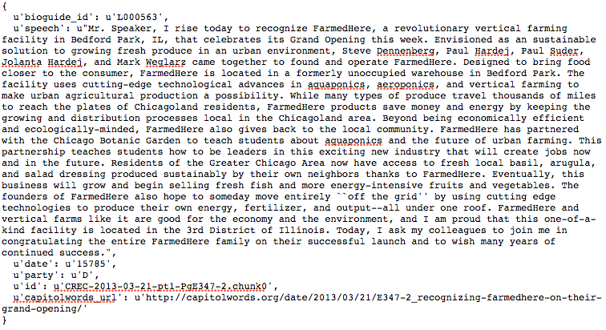
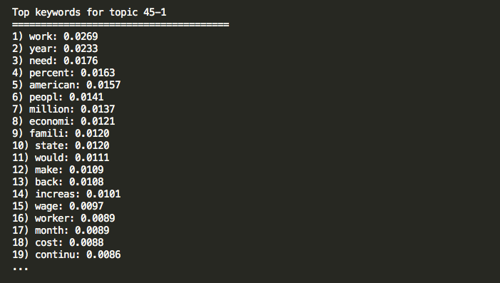
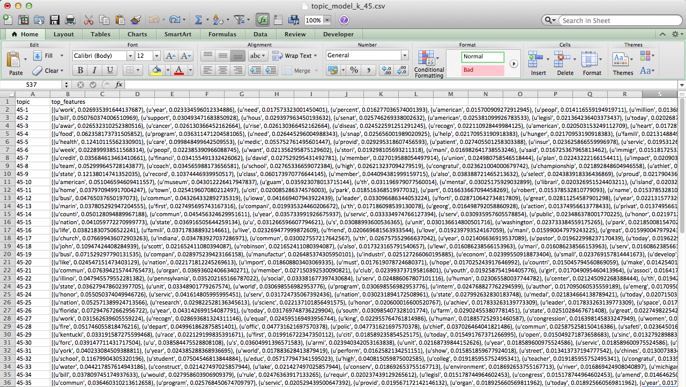

`rlda`: Robust Latent Dirichlet Allocation models 
-------------------------

This python module provides a set of functions to fit multiple LDA models to a 
text corpus and then search for the robust topics present in multiple models.

In natural language processing LDA models are used to classify text into topics. However, the substance of
topics often varies depending on model specification (e.g. number of *k* topics), making them
quite unstable (see Chuang_ 2015). This `python` module implements a method 
proposed by Wilkerson and Casas (2017) to add a level of robustness when using
unsupervised topic models. You can find the replication material for the Wilkerson and Casas (2017) paper in this_ GitHub repository.

Please cite as:

Wilkerson, John and Andreu Casas. 2017. "Large-scale Computerized Text
Analysis in Political Science: Opportunities and Challenges." *Annual Review
of Political Science*, 20:x-x. (Forthcoming)

Installation
-------------------------
``pip install rlda``

Example: studying the topic of one-minute floor speeches
--------------------------------------------------------

>>> import rlda
>>> import random 

Loading all one-minute floor speeches from House representatives of the 113th Congress (n = 9,704). This dataset already comes with the module

>>> sample_data = rlda.speeches_data

Each observation or speech is a `dictionary` with the following keys: bioguide_ide, speech, date, party, id, captiolwords_url.

Create a list conatining only the speeches. Using only a sample of 1,000 random speeches for this example so that it runs faster.

>>> speeches = [d['speech'] for d in sample_data]
>>> random.seed(1)
>>> rand_vector = random.sample(xrange(len(speeches)), 1000)
>>> sample = speeches[:100]

Create an object of class RLDA so that you can implement all functions in this module

>>> robust_model = rlda.RLDA()

Pre-process the sample of speeches. These are the default settings, but you can choose your pre-processing parameters:

   - Parsing speeches into words (features)
   - Removing punctuation
   - Removing stopwords (the default list, <stopw>, is the english stopwords list from the `nltk` module)
   - Removing words shorter than 3 characters
   - Stemming remaining words (Porter Stemmer)

>>> clean_speeches = rlda.pre_processing(sample, remove_punct = True,
                        remove_stopwords = True, stopwords_list = stopw,
                        remove_words_shorter_than = 3, steming = True)

Construct a Term Document Matrix (TDM) from the speeches text

>>> robust_model.get_tdm(clean_speeches)

Specify in a list the number of topics (k) of the LDA models you want to estimate. For example, 3 LDA models, one with 45 topics, one with 50, and one with 55

>>> k_list = [45, 50, 55]

Specify the number of iterations when estimating the LDA models (e.g. 300)

>>> n_iter = 300

Fit the multiple LDA models 

>>> robust_model.fit_models(k_list = k_list, n_iter = n_iter)

Get the feature-topic-probabilty vectors for each topic, and also the top(e.g. 50) keywords for each topic

>>> robust_model.get_all_ftp(features_top_n = 50)

You can explore now the top keywords of a topic in the console by using this funciton and specifying the topic label: "k-t" where k = the number of topics of that model, and t = the topic number. For example, "45-1" is the first topic of the topic-model with 45 topics...

>>> robust_model.show_top_kws('45-1')

... or you can also save the top keywords for each model's topics in a separate "csv" file and explore them in Excel

>>> robust_model.save_top_kws()

Save the classifications (topic with the highest probability) made by each lda model. Run this function to create a directory named "classifications" that will have as many "csv" files as topic-models you run. The "csv" files will have 2 variables: "top_topic" (the topic of each document), and "text" (the text of the document).

>>> robust_model.save_models_classificiations()

Clustering topics to get more robust meta-topics
--------------------------------------------------------

Create a cosine similarity matrix. Dimensions = TxT, where T = (number topics from all topic models). In this example the dimensions of the cosine matrix will be 150x150

>>> robust_model.get_cosine_matrix()

Clustering the topics into N clusters, e.g. 50 clusters, using Spectral_ Clustering. 

>>> clusters = robust_model.cluster_topics(clusters_n = 50)

... still editing! To be continued...

.. _Chuang: http://www.aclweb.org/anthology/N15-1018  
.. _Spectral: http://scikit-learn.org/stable/modules/generated/sklearn.cluster.SpectralClustering.html
.. _this: https://github.com/CasAndreu/wilkerson_casas_2016_TAD
