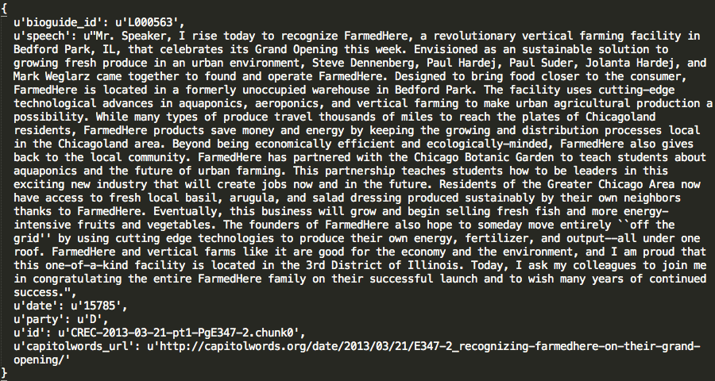

`rlda`: Robust Latent Dirichlet Allocation models 
-------------------------

This python module provides a set of functions to fit multiple LDA models to a 
text corpus and then search for the robust topics present in multiple models.

In natural language processing LDA models are used to classify text into topics. However, the substance of
topics often varies depending on model specification (e.g. number of *k* topics), making them
quite unstable (see Chuang_ 2015). This `python` module implements a method 
proposed by Wilkerson and Casas (2016) to add a level of robustness when using
unsupervised topic models.

Please cite as:

Wilkerson, John and Andreu Casas. 2016. "Large-scale Computerized Text
Analysis in Political Science: Opportunities and Challenges." *Annual Review
of Political Science*, AA:x-x. (Forthcoming)

.. _Chuang: http://www.aclweb.org/anthology/N15-1018  

Installation
-------------------------
``pip install rlda``

Example: studying the topic of one-minute floor speeches
--------------------------------------------------------

>>> import rlda

Loading all one-minute floor speeches from House representatives of the 113th Congress (n = 9,704). This dataset already comes with the module

>>> sample_data = rlda.speeches_data

Each observation or speech is a `dictionary` with the following keys: bioguide_ide, speech, date, party, id, captiolwords_url.

Create a list with only the speeches

>>> speeches = [d['speech'] for d in sample_data]

